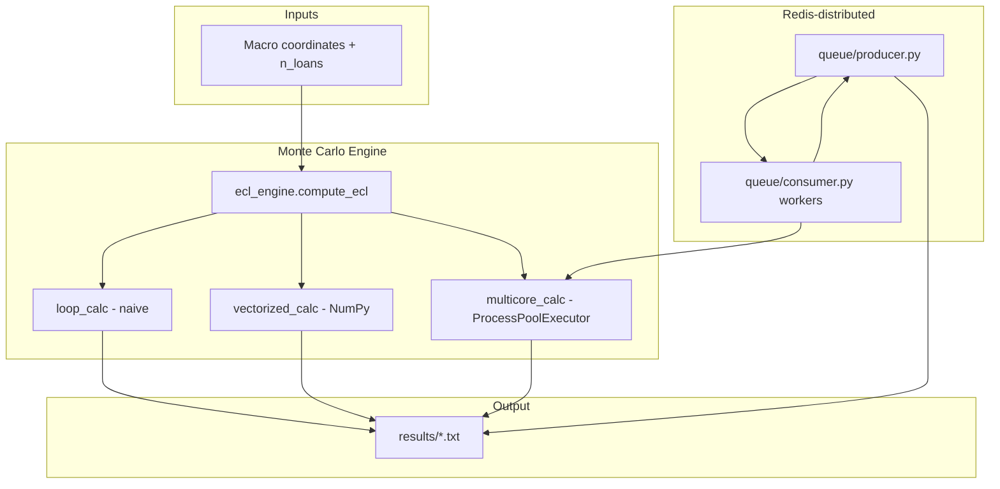

# Monte Carlo Expected Credit Loss Simulator

A quantitative credit-risk system that forecasts **Expected Credit Loss (ECL)** on large loan portfolios under macroeconomic stress, computed entirely locally via **Monte Carlo simulation** — vectorized NumPy, multi-core, and Redis-distributed workers.

The original TypeScript prototype (branch `v1-typescript-prototype`) validated core PD/LGD math. This branch adds Python vectorization and distributed execution.

---

## Table of contents

1. [Architecture](#architecture)
2. [Project layout](#project-layout)
3. [Prerequisites](#prerequisites)
4. [Installation](#installation)
5. [Quick start](#quick-start)
6. [Monte Carlo simulation engine](#monte-carlo-simulation-engine)
7. [Distributed simulation (Redis queue)](#distributed-simulation-redis-queue)
8. [Docker](#docker)
9. [Testing](#testing)
10. [Configuration reference](#configuration-reference)
11. [Troubleshooting](#troubleshooting)
12. [Development notes](#development-notes)

---

## Architecture



**Data flow summary**

| Stage | What happens |
|-------|--------------|
| **Configure** | Macro coordinates + portfolio size (`N_LOANS`) load from `.env` via `risk_engine.config`, or are passed as CLI flags |
| **Simulate** | `compute_ecl()` maps macro inputs → hazard rate → PD, then Monte Carlo–samples defaults across the portfolio, run via one of four execution strategies |
| **Aggregate** | `ECL = defaults × AVG_EXPOSURE × LGD` |
| **Output** | Each runner writes its results to a text file under `results/` |

---

## Project layout

```
.
├── results/                           # Simulation output text files
│   ├── naive_results.txt
│   ├── vectorized_results.txt
│   ├── multicore_results.txt
│   ├── redis_results.txt
│   └── all_results.txt
├── src/risk_engine/                   # Main installable Python package
│   ├── config.py                      # .env loading, path constants, bounds
│   ├── monte_carlo/                   # Core ECL engine + simulators
│   │   ├── ecl_engine.py              # macro → hazard → PD → ECL
│   │   ├── loop_calc.py               # Naive Python loop (baseline)
│   │   ├── vectorized_calc.py         # NumPy vectorized (fast)
│   │   ├── multicore_calc.py          # ProcessPoolExecutor parallel
│   │   └── run_all.py                 # Run all three + merge results
│   └── queue/                         # Redis distributed simulation
│       ├── consumer.py                # Worker: pops jobs, runs chunks
│       └── producer.py                # Pushes jobs, collects results
├── tests/
│   ├── conftest.py                    # Shared pytest fixtures
│   └── unit/                          # ECL engine + smoke tests
├── docker-compose.yml
├── Dockerfile
├── pyproject.toml
└── .env.example
```

---

## Prerequisites

| Requirement | Version / notes |
|-------------|-----------------|
| **Python** | 3.13 or 3.14 (`>=3.13,<3.15`) |
| **Poetry** | Latest — [install guide](https://python-poetry.org/docs/#installation) |
| **Redis** | Optional locally; only needed for distributed simulation. Included in Docker Compose |
| **Docker Desktop** | Optional — for containerized Redis + workers |

---

## Installation

From the project root:

```bash
# Install dependencies + the risk_engine package
poetry install

# Create your local config
cp .env.example .env   # Windows: copy .env.example .env
```

`poetry install` registers the `risk_engine` package. All commands below use `python -m risk_engine...` — no manual `PYTHONPATH` setup required.

**Optional:** activate the virtual environment to drop the `poetry run` prefix:

```bash
poetry shell
python -m risk_engine.monte_carlo.vectorized_calc
```

---

## Quick start

```bash
# Fast vectorized run (override portfolio size for quick test)
poetry run python -m risk_engine.monte_carlo.vectorized_calc --n-loans 1000000
```

Results are written to `results/vectorized_results.txt`.

---

## Monte Carlo simulation engine

The core function is `risk_engine.monte_carlo.ecl_engine.compute_ecl()`:

```
macro inputs → hazard rate → PD = 1 - exp(-hazard × horizon)
             → Monte Carlo default count → ECL = defaults × AVG_EXPOSURE × LGD
```

**Macro features**

| Feature | Baseline | Effect on credit risk |
|---------|----------|----------------------|
| `unemployment_rate` | 4.0% | Higher → higher hazard |
| `interest_rate` | 3.0% | Higher → higher hazard |
| `housing_price_index` | 100.0 | Lower → higher hazard |

At baseline values, hazard rate equals `BASE_HAZARD_RATE` (default 5%).

### Simulation runners

All runners accept `--n-loans` to override `N_LOANS` from `.env`.

| Module | Command | Speed | Output file |
|--------|---------|-------|-------------|
| Naive loop | `python -m risk_engine.monte_carlo.loop_calc` | Slowest (baseline) | `results/naive_results.txt` |
| Vectorized | `python -m risk_engine.monte_carlo.vectorized_calc` | Fast (NumPy) | `results/vectorized_results.txt` |
| Multicore | `python -m risk_engine.monte_carlo.multicore_calc` | Parallel CPU cores | `results/multicore_results.txt` |
| All three | `python -m risk_engine.monte_carlo.run_all` | Runs all + merges | `results/all_results.txt` |

**Example — quick local test:**

```bash
poetry run python -m risk_engine.monte_carlo.vectorized_calc --n-loans 50000
```

---

## Distributed simulation (Redis queue)

Split a large portfolio across Redis workers:

```bash
# Terminal 1 — start worker(s)
poetry run python -m risk_engine.queue.consumer

# Terminal 2 — push jobs and collect results
poetry run python -m risk_engine.queue.producer
```

The producer splits `N_LOANS` into `N_JOBS` chunks (default 10), pushes them to the `simulation_jobs` queue, waits for `simulation_results`, and writes `results/redis_results.txt`.

---

## Docker

**Prerequisites:** [Docker Desktop](https://www.docker.com/products/docker-desktop/) installed and running.

### Service overview

| Service | Role | Port |
|---------|------|------|
| `redis` | Redis Stack + RedisInsight | 6379, 8001 |
| `worker` | Simulation consumer(s) | — |
| `api` | Simulation **producer** (one-shot) | — |

```bash
# Build image
docker compose build

# Start Redis + 3 workers
docker compose up -d redis
docker compose up -d --scale worker=3

# Run producer once (prints results, then exits)
docker compose run --rm api

# View worker logs
docker compose logs -f worker

# Stop everything
docker compose down
```

**One-liner** (build + start all, producer runs once):

```bash
docker compose up --build --scale worker=3
```

---

## Testing

```bash
# All unit tests
poetry run python -m pytest

# Verbose output
poetry run python -m pytest -v

# Single test file
poetry run python -m pytest tests/unit/test_ecl_engine.py -v
```

---

## Configuration reference

All settings load from `.env` in the project root via `risk_engine.config`. Copy `.env.example` to get started.

### Simulation

| Variable | Default | Description |
|----------|---------|-------------|
| `N_LOANS` | `100000000` | Portfolio size for Monte Carlo sims |
| `HAZARD_RATE` | `0.05` | Base annual hazard rate (5%) |
| `TIME_HORIZON` | `1.0` | Simulation horizon in years |
| `BASE_HAZARD_RATE` | `0.05` | Hazard rate at baseline macros |
| `AVG_EXPOSURE` | `250000` | Average loan exposure ($) |
| `LGD` | `0.45` | Loss given default (fraction) |
| `N_JOBS` | `10` | Redis job chunks for distributed sim |

### Macro environment

| Variable | Default | Description |
|----------|---------|-------------|
| `MACRO_BASELINE_UNEMPLOYMENT` | `4.0` | Neutral unemployment (%) |
| `MACRO_BASELINE_INTEREST` | `3.0` | Neutral interest rate (%) |
| `MACRO_BASELINE_HPI` | `100.0` | Neutral housing price index |
| `MACRO_UNEMPLOYMENT_MIN/MAX` | `2.0` / `15.0` | Sampling & clipping bounds |
| `MACRO_INTEREST_MIN/MAX` | `0.0` / `12.0` | Sampling & clipping bounds |
| `MACRO_HPI_MIN/MAX` | `70.0` / `130.0` | Sampling & clipping bounds |

### Redis

| Variable | Default | Description |
|----------|---------|-------------|
| `REDIS_HOST` | `localhost` | Redis hostname |
| `REDIS_PORT` | `6379` | Redis port |

### Artifact paths (convention, not env vars)

| Path | Contents |
|------|----------|
| `results/*.txt` | Simulation output files |

---

## Troubleshooting

### Docker: "cannot connect to Docker Desktop"

Start Docker Desktop and wait until the tray icon shows it's ready.

### `queue/producer.py` times out waiting for results

No consumers are running, or they can't reach Redis. Start at least one worker: `poetry run python -m risk_engine.queue.consumer`, and confirm `REDIS_HOST`/`REDIS_PORT` in `.env` match the running Redis instance.

---

## Development notes

### Package structure

The project uses a standard src-layout package:

```
src/risk_engine/    ← import as risk_engine.*
```

Installed via Poetry (`[tool.poetry] packages = [{ include = "risk_engine", from = "src" }]`). All modules use absolute imports (`from risk_engine.config import ...`) — no `sys.path` hacks.

### Key design decisions

| Decision | Rationale |
|----------|-----------|
| `queue/` not `redis/` | Avoids import collision with PyPI `redis` package |
| Four execution strategies | Naive/vectorized/multicore/Redis-distributed let you directly compare runtime at scale |

### Dependencies

| Package | Role |
|---------|------|
| `numpy` | Simulation math |
| `redis` | Distributed job queue |
| `python-dotenv` | `.env` loading |
| `pytest` (dev) | Tests |
