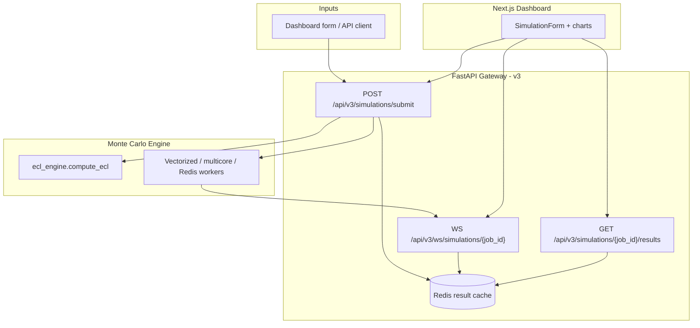

# Monte Carlo Expected Credit Loss Simulator

A quantitative credit-risk system that forecasts **Expected Credit Loss (ECL)** on large loan portfolios under macroeconomic stress. It combines:

- **Monte Carlo simulation** (vectorized NumPy, multi-core, and Redis-distributed workers)
- A **FastAPI gateway** (v3) that runs simulations synchronously or streams multicore progress over a WebSocket
- **Redis caching** of simulation results
- A **Next.js dashboard** for submitting scenarios and visualizing results

The original TypeScript prototype (branch `v1-typescript-prototype`) validated core PD/LGD math. This branch adds Python vectorization, distributed execution, and a web dashboard.

---

## Table of contents

1. [Architecture](#architecture)
2. [Project layout](#project-layout)
3. [Prerequisites](#prerequisites)
4. [Installation](#installation)
5. [Quick start](#quick-start)
6. [Monte Carlo simulation engine](#monte-carlo-simulation-engine)
7. [v3 simulation API](#v3-simulation-api)
8. [Frontend dashboard](#frontend-dashboard)
9. [Redis: job queue vs result cache](#redis-job-queue-vs-result-cache)
10. [Docker](#docker)
11. [Testing](#testing)
12. [Configuration reference](#configuration-reference)
13. [Troubleshooting](#troubleshooting)
14. [Development notes](#development-notes)

---

## Architecture



**Data flow summary**

| Stage | What happens |
|-------|--------------|
| **Submit** | Client posts macro coordinates + method → `POST /api/v3/simulations/submit` |
| **Compute** | `vectorized` runs synchronously; `multicore` fans chunks across `ProcessPoolExecutor` in a background task and streams progress over the WebSocket |
| **Cache** | Completed results are written to Redis under `sim_result:{job_id}` |
| **Fetch** | Client polls `GET /api/v3/simulations/{job_id}/results` or reads the WebSocket's `final` event |

---

## Project layout

```
.
├── results/                           # Simulation output text files
│   ├── naive_results.txt
│   ├── vectorized_results.txt
│   ├── multicore_results.txt
│   ├── redis_results.txt
│   └── all_results.txt
├── frontend/                          # Next.js dashboard
│   ├── app/                           # Landing page + dashboard/[jobId] route
│   ├── components/                    # SimulationForm, charts, skeletons
│   ├── hooks/                         # useSimulation, useWebSocket
│   └── lib/                           # API client, types, formatting
├── src/risk_engine/                   # Main installable Python package
│   ├── config.py                      # .env loading, path constants, bounds
│   ├── monte_carlo/                   # Core ECL engine + simulators
│   │   ├── ecl_engine.py              # macro → hazard → PD → ECL
│   │   ├── loop_calc.py               # Naive Python loop (baseline)
│   │   ├── vectorized_calc.py         # NumPy vectorized (fast)
│   │   ├── multicore_calc.py          # ProcessPoolExecutor parallel
│   │   └── run_all.py                 # Run all three + merge results
│   ├── queue/                         # Redis distributed simulation
│   │   ├── consumer.py                # Worker: pops jobs, runs chunks
│   │   └── producer.py                # Pushes jobs, collects results
│   ├── api/                           # v3 FastAPI gateway
│   │   ├── app.py                     # FastAPI application
│   │   ├── simulations.py             # POST /submit, GET /{job_id}/results
│   │   ├── ws.py                      # WS /simulations/{job_id} (multicore progress)
│   │   ├── cache.py                   # Redis result cache
│   │   └── schemas.py                 # Pydantic API request/response models
│   └── testing/                       # Shared test doubles
│       └── fakes.py                   # FakeRedis for unit tests
├── tests/
│   ├── conftest.py                    # Shared pytest fixtures
│   ├── unit/                          # Fast tests (no external services)
│   └── integration/                   # API TestClient + live Redis
├── docker-compose.yml
├── Dockerfile
├── pyproject.toml
└── .env.example
```

---

## Prerequisites

| Requirement | Version / notes |
|-------------|-----------------|
| **Python** | 3.13 or 3.14 (`>=3.13,<3.15`) |
| **Poetry** | Latest — [install guide](https://python-poetry.org/docs/#installation) |
| **Node.js** | 20+ — only needed for the frontend dashboard |
| **Redis** | Optional locally; included in Docker Compose |
| **Docker Desktop** | Optional — for containerized Redis, workers, and API |

---

## Installation

From the project root:

```bash
# Install dependencies + the risk_engine package
poetry install

# Create your local config
cp .env.example .env   # Windows: copy .env.example .env
```

`poetry install` registers the `risk_engine` package. All commands below use `python -m risk_engine...` — no manual `PYTHONPATH` setup required.

**Optional:** activate the virtual environment to drop the `poetry run` prefix:

```bash
poetry shell
python -m risk_engine.monte_carlo.vectorized_calc
```

---

## Quick start

### Option A — Run the API + dashboard

```bash
# Terminal 1 — backend
poetry run uvicorn risk_engine.api.app:app --app-dir src --reload --port 8080

# Terminal 2 — frontend
cd frontend
npm install
npm run dev
```

Open **http://localhost:3000**, pick a preset scenario, choose a method, and submit.

### Option B — Monte Carlo simulation only (no API)

```bash
# Fast vectorized run (override portfolio size for quick test)
poetry run python -m risk_engine.monte_carlo.vectorized_calc --n-loans 1000000
```

Results are written to `results/vectorized_results.txt`.

---

## Monte Carlo simulation engine

The core function is `risk_engine.monte_carlo.ecl_engine.compute_ecl()`:

```
macro inputs → hazard rate → PD = 1 - exp(-hazard × horizon)
             → Monte Carlo default count → ECL = defaults × AVG_EXPOSURE × LGD
```

**Macro features**

| Feature | Baseline | Effect on credit risk |
|---------|----------|----------------------|
| `unemployment_rate` | 4.0% | Higher → higher hazard |
| `interest_rate` | 3.0% | Higher → higher hazard |
| `housing_price_index` | 100.0 | Lower → higher hazard |

At baseline values, hazard rate equals `BASE_HAZARD_RATE` (default 5%).

### Simulation runners

All runners accept `--n-loans` to override `N_LOANS` from `.env`.

| Module | Command | Speed | Output file |
|--------|---------|-------|-------------|
| Naive loop | `python -m risk_engine.monte_carlo.loop_calc` | Slowest (baseline) | `results/naive_results.txt` |
| Vectorized | `python -m risk_engine.monte_carlo.vectorized_calc` | Fast (NumPy) | `results/vectorized_results.txt` |
| Multicore | `python -m risk_engine.monte_carlo.multicore_calc` | Parallel CPU cores | `results/multicore_results.txt` |
| All three | `python -m risk_engine.monte_carlo.run_all` | Runs all + merges | `results/all_results.txt` |

**Example — quick local test:**

```bash
poetry run python -m risk_engine.monte_carlo.vectorized_calc --n-loans 50000
```

### Distributed simulation (Redis queue)

Split a large portfolio across Redis workers:

```bash
# Terminal 1 — start worker(s)
poetry run python -m risk_engine.queue.consumer

# Terminal 2 — push jobs and collect results
poetry run python -m risk_engine.queue.producer
```

The producer splits `N_LOANS` into `N_JOBS` chunks (default 10), pushes them to the `simulation_jobs` queue, waits for `simulation_results`, and writes `results/redis_results.txt`.

---

## v3 simulation API

Base URL: **http://localhost:8080**

Interactive docs: **http://localhost:8080/docs** (Swagger UI)

### `GET /health`

Returns service status and Redis cache availability.

```json
{
  "status": "ok",
  "cache_enabled": true,
  "cache_available": true
}
```

`cache_available: false` means Redis is unreachable — the API still works, just without caching.

### `POST /api/v3/simulations/submit`

Submit macro coordinates and run a simulation.

**Request body:**

```json
{
  "unemployment_rate": 6.5,
  "interest_rate": 5.25,
  "housing_price_index": 95.0,
  "n_loans": 1000000,
  "method": "vectorized"
}
```

| Field | Type | Valid range / values |
|-------|------|----------------------|
| `unemployment_rate` | float | 2.0 – 15.0 (percent) |
| `interest_rate` | float | 0.0 – 12.0 (percent) |
| `housing_price_index` | float | 70.0 – 130.0 (index level) |
| `n_loans` | int | 1,000 – 100,000,000 |
| `method` | string | `vectorized` \| `multicore` |

- `vectorized` completes synchronously and returns `"status": "completed"`.
- `multicore` runs in a background task and returns `"status": "queued"` with a `ws_url` for live progress.

**Response (vectorized):**

```json
{
  "job_id": "a1b2c3...",
  "status": "completed",
  "ws_url": null
}
```

**Response (multicore):**

```json
{
  "job_id": "a1b2c3...",
  "status": "queued",
  "ws_url": "/api/v3/ws/simulations/a1b2c3..."
}
```

### `GET /api/v3/simulations/{job_id}/results`

Fetch cached results. Returns `202` with `{"status": "running"}` while a multicore job is still in flight, `404` if the job is unknown, and `200` with the full `SimulationResults` payload once complete — including `ecl_distribution` (100 samples from different seeds) and `percentiles` (p5/p25/p50/p75/p95) for charting.

### `WS /api/v3/ws/simulations/{job_id}`

For `multicore` jobs, streams `progress` and `intermediate` events as chunks finish across cores, then a `final` event with the complete result. Completed jobs (including `vectorized`) get an immediate `final` event and the connection closes.

```json
{"type": "progress", "completed": 5000000, "total": 50000000, "elapsed_ms": 45}
{"type": "intermediate", "defaults_so_far": 243000, "current_ecl": 27337500000}
{"type": "final", "ecl": 5487562500, "defaults": 4878500, "default_rate": 0.04878, "elapsed_ms": 182}
```

---

## Frontend dashboard

A Next.js dashboard lives in `frontend/` — see [`frontend/README.md`](frontend/README.md) for setup, structure, and usage. It submits scenarios to the v3 API, streams multicore progress over the WebSocket, and renders an ECL distribution histogram and hazard-rate heatmap.

---

## Redis: job queue vs result cache

Redis serves **two independent purposes** in this project:

| Purpose | Key pattern | Used by | TTL |
|---------|-------------|---------|-----|
| **Simulation job queue** | `simulation_jobs`, `simulation_results` | `queue/producer.py`, `queue/consumer.py` | None (lists) |
| **Simulation result cache** | `sim_result:{job_id}` | `api/cache.py`, FastAPI | 24 h (configurable) |

They do not share keys. You can run the v3 API with Redis caching without running distributed simulation workers, and vice versa.

**Inspect in RedisInsight:** http://localhost:8001 (when Redis is running via Docker)

---

## Docker

**Prerequisites:** [Docker Desktop](https://www.docker.com/products/docker-desktop/) installed and running.

### Service overview

| Service | Role | Port |
|---------|------|------|
| `redis` | Redis Stack + RedisInsight | 6379, 8001 |
| `worker` | Simulation consumer(s) | — |
| `api` | Simulation **producer** (one-shot) | — |
| `simulation-api` | v3 FastAPI gateway | 8080 |
| `frontend` | Next.js dashboard | 3000 |

> **Important:** The `api` service is the Monte Carlo simulation producer, **not** the FastAPI gateway. The gateway is `simulation-api`.

### Monte Carlo distributed simulation

```bash
# Build image
docker compose build

# Start Redis + 3 workers
docker compose up -d redis
docker compose up -d --scale worker=3

# Run producer once (prints results, then exits)
docker compose run --rm api

# View worker logs
docker compose logs -f worker

# Stop everything
docker compose down
```

**One-liner** (build + start all, producer runs once):

```bash
docker compose up --build --scale worker=3
```

### v3 API + dashboard

```bash
docker compose build
docker compose up -d redis simulation-api frontend

# Health check
curl http://localhost:8080/health

# Submit a simulation
curl -X POST http://localhost:8080/api/v3/simulations/submit \
  -H "Content-Type: application/json" \
  -d '{"unemployment_rate": 6.5, "interest_rate": 5.25, "housing_price_index": 95.0, "n_loans": 1000000, "method": "vectorized"}'
```

Open http://localhost:3000 for the dashboard.

---

## Testing

```bash
# All unit + integration tests (skips live Redis if down)
poetry run python -m pytest

# Exclude tests that need a running Redis instance
poetry run python -m pytest -m "not integration"

# Verbose output
poetry run python -m pytest -v

# Single test file
poetry run python -m pytest tests/unit/test_ecl_engine.py -v
```

**Test layout:**

| Directory | What it covers |
|-----------|----------------|
| `tests/unit/` | ECL engine, v3 simulation API, cache |
| `tests/integration/` | FastAPI TestClient, live Redis round-trip |
| `tests/conftest.py` | Shared fixtures: `api_client`, `FakeRedis` |

---

## Configuration reference

All settings load from `.env` in the project root via `risk_engine.config`. Copy `.env.example` to get started.

### Simulation

| Variable | Default | Description |
|----------|---------|-------------|
| `N_LOANS` | `100000000` | Portfolio size for Monte Carlo sims |
| `HAZARD_RATE` | `0.05` | Base annual hazard rate (5%) |
| `TIME_HORIZON` | `1.0` | Simulation horizon in years |
| `BASE_HAZARD_RATE` | `0.05` | Hazard rate at baseline macros |
| `AVG_EXPOSURE` | `250000` | Average loan exposure ($) |
| `LGD` | `0.45` | Loss given default (fraction) |
| `N_JOBS` | `10` | Redis job chunks for distributed sim |

### Macro environment

| Variable | Default | Description |
|----------|---------|-------------|
| `MACRO_BASELINE_UNEMPLOYMENT` | `4.0` | Neutral unemployment (%) |
| `MACRO_BASELINE_INTEREST` | `3.0` | Neutral interest rate (%) |
| `MACRO_BASELINE_HPI` | `100.0` | Neutral housing price index |
| `MACRO_UNEMPLOYMENT_MIN/MAX` | `2.0` / `15.0` | Sampling & clipping bounds |
| `MACRO_INTEREST_MIN/MAX` | `0.0` / `12.0` | Sampling & clipping bounds |
| `MACRO_HPI_MIN/MAX` | `70.0` / `130.0` | Sampling & clipping bounds |

### Redis

| Variable | Default | Description |
|----------|---------|-------------|
| `REDIS_HOST` | `localhost` | Redis hostname |
| `REDIS_PORT` | `6379` | Redis port |
| `ECL_CACHE_ENABLED` | `true` | Enable simulation result cache |
| `ECL_CACHE_TTL` | `86400` | Cache TTL in seconds (24 h) |

### Artifact paths (convention, not env vars)

| Path | Contents |
|------|----------|
| `results/*.txt` | Simulation output files |

---

## Troubleshooting

### Port 8080 already in use (WinError 10048)

Another process (or a previous uvicorn instance) holds the port. Stop it or use a different port:

```bash
poetry run uvicorn risk_engine.api.app:app --app-dir src --port 8081
```

### Redis cache not working locally

- Start Redis: `docker compose up -d redis`
- Check health: `GET /health` → `cache_available: true`
- API works without Redis — caching is optional

### Docker: "cannot connect to Docker Desktop"

Start Docker Desktop and wait until the tray icon shows it's ready.

### Multicore job stuck at "running"

`GET /{job_id}/results` returns `202` while the background task is still executing — connect to the WebSocket (`ws_url` from the submit response) for live progress, or keep polling.

---

## Development notes

### Package structure

The project uses a standard src-layout package:

```
src/risk_engine/    ← import as risk_engine.*
```

Installed via Poetry (`[tool.poetry] packages = [{ include = "risk_engine", from = "src" }]`). All modules use absolute imports (`from risk_engine.config import ...`) — no `sys.path` hacks.

### Key design decisions

| Decision | Rationale |
|----------|-----------|
| Separate Redis cache keys | Avoids collision with simulation job queues |
| `queue/` not `redis/` | Avoids import collision with PyPI `redis` package |
| Multicore streams over WebSocket | Keeps `/submit` responsive for large portfolios |

### Dependencies

| Package | Role |
|---------|------|
| `numpy` | Simulation math |
| `fastapi`, `uvicorn` | REST + WebSocket API |
| `redis` | Job queue + result cache |
| `python-dotenv` | `.env` loading |
| `pytest`, `httpx` (dev) | Tests + FastAPI TestClient |
